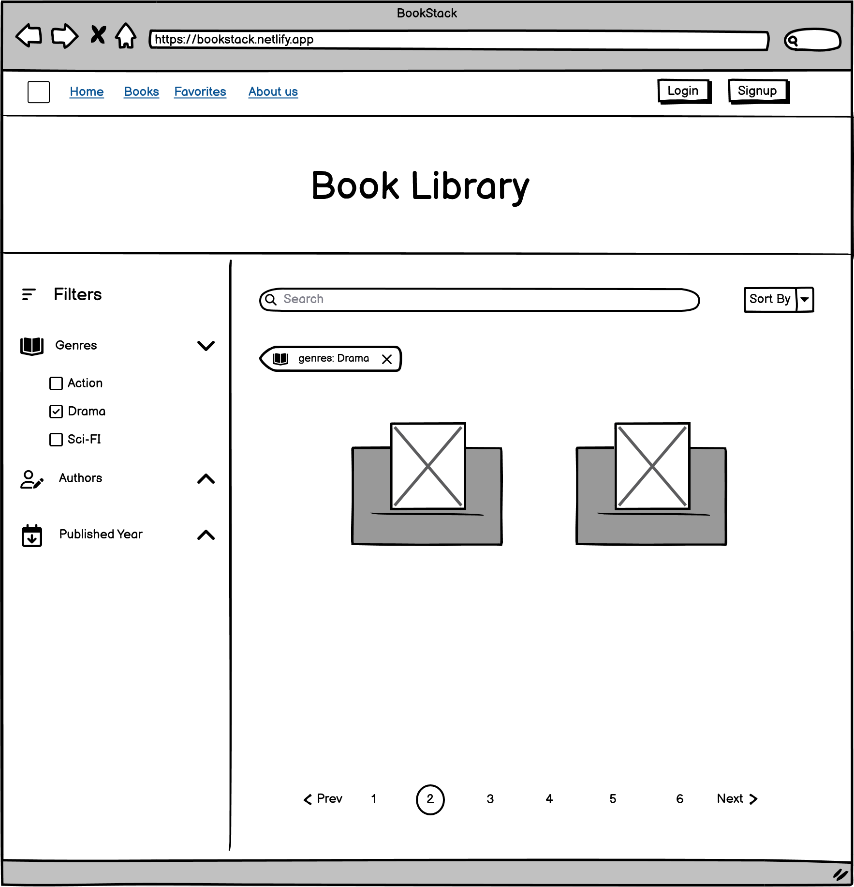
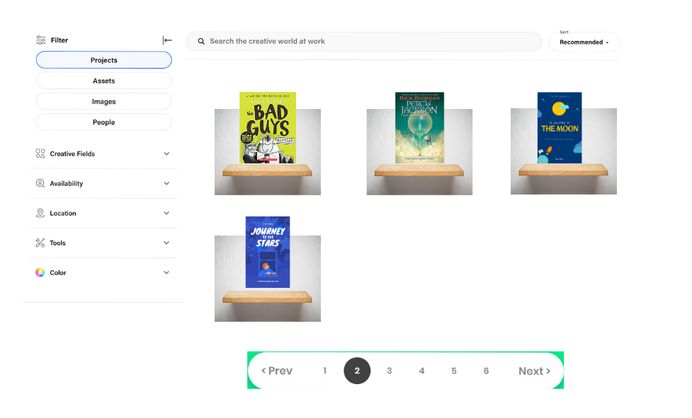
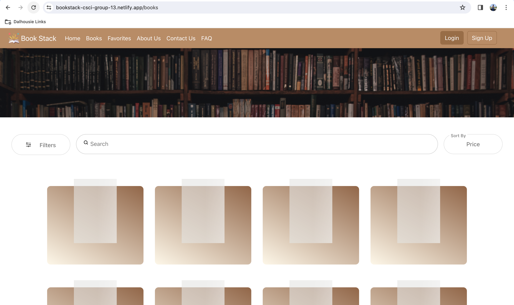
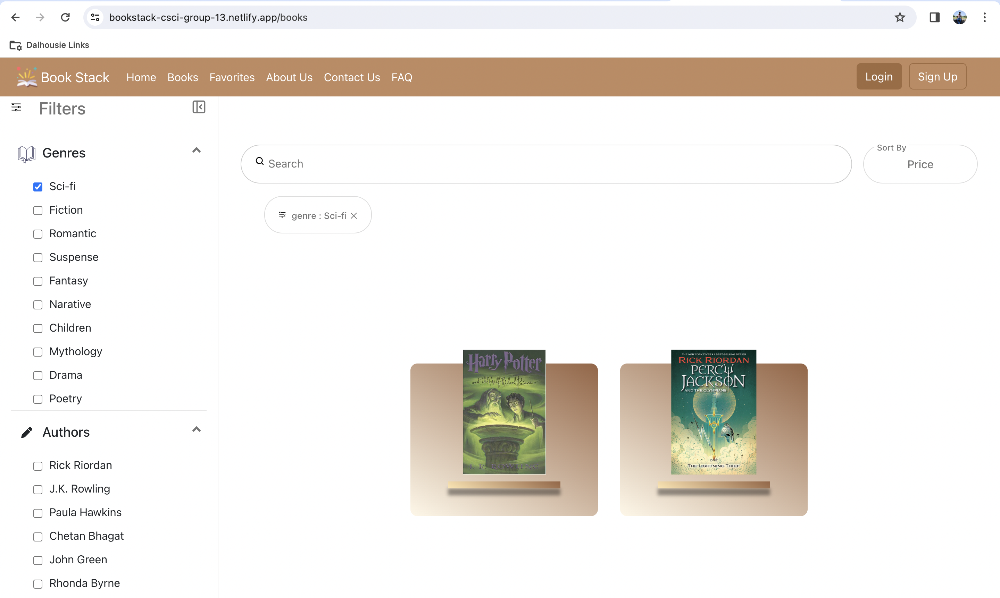

# CSCI 5709 Grp-13

Group project for 5709 Advanced Web services.

# Book Stack - v3

This version of our application have 85% of features completed. 

## Authors

1. Member 1

   - Name:- [Ashish Nagpal](ashish.nagpal@dal.ca)
   - Branch Name:- ashish-nagpal

2. Member 2

   - Name:- [Aiwin Charalil Manuel](aiwin.manuel@dal.ca)
   - Branch Name:- Aiwin_Charalil_Manuel

3. Member 3

   - Name:- [Jinal Dave](jinal.dave@dal.ca)
   - Branch Name:- jinal-dave

4. Member 4

   - [Abhinav Acharya Tirumala Vinjamuri](ab806657@dal.ca)
   - Branch Name:- Abhinav_Acharya

5. Member 5

   - Name:- [Arihant Dugar](arihant.dugar@dal.ca)
   - Branch Name:- arihant-dugar

6. Member 6
   - Name:- [Yogish Honnadevipura Gopalakrishna](yg926299@dal.ca)
   - Branch Name:- yogish

## Links

1. Gitlab Repo: https://git.cs.dal.ca/anagpal/csci-5709-grp-13/-/tree/main?ref_type=heads
2. Frontend Deployment Link - Netlify: https://bookstack-csci-group-13.netlify.app/
3. Backend Deployment Link - Render: https://bookstack-grp13.onrender.com

# Requirements
The requirement of the project was to develop an application that posses **_User eXperience and usability_** for the users by following **_design principles_**. We were expected to create the user personas, sitemaps, wireframes, prototypes of the project along with semi-functional draft of the application that satisfies all the task for the complete feature. Using the best suitable design, we had to proceed with the project and complete atleast 70% of the project. 

# My Contribution
I designed and developed the book library component along with the navigation bar in the initial phase. Before coding the page, I created the **low and high fidelity Prototype** to understand the look and feel of it. The component was designed to have a seamless user experience among all the target users. Users who love books usually wish to have their own personal library with a lot of books kept on the shelves sorted according to the name or genre. Thereby, to give the same aesthetic, a book shelf has been added under each book with the color-coding of the book library. The iconography is used with all the filter options available to increase usability and give a clear view of the options. 

After the parallel design phase, my design was approved by all the teammates, and we continued to develop the entire project. The design was responsive. I also made sure that the skeleton loading screen should be visible to the users until the books are loaded from the backend. Mostly, book readers are familiar with the book covers; hence, I have designed the page in such a way that it only requires scanning. 


<center style= text-align="center" >Figure 1: Low Fidelity Prototype </center>  <br>


<center style= text-align="center" >Figure 2: High Fidelity Prototype </center>  <br>

# Installing

1. Clone the project repository by using the URL - https://git.cs.dal.ca/anagpal/csci-5709-grp-13

2. Go into the project directory and install the required dependency for frontend and backend application using ```npm install``` command.

3. Set up the environment variables by looking at the ``.env.example`` file

4. Once the dependencies are installed, start the development server by ```npm start``` command.

5. The server for frontend application will be running on port - 3000 [http://localhost:3000](http://localhost:3000). For backend the server will be running on port 8080.

# Deployment

This directory contains a stable deployement version of the application. The ```front-end``` is deployed on Netlify which we configured by adding a remote that pushes the code to GitHub. The ```backend``` is deployed on Render using the same process. We have employed ```MongoDB``` for the database.

Deployment for Frontend is made through **Netlify**. 
[](https://app.netlify.com/sites/bookstack-csci-group-13/deploys)

Deployment for backend server is done on **Render**. 


# Testing

## Login Details

### Admin login credentials
- Username: abhinava465@gmail.com
- Password: securepassword

### User login credentials
- Username: ab806657@dal.ca
- Password: pass@1234

## Screenshots


<center style= text-align="center" >Figure 3: Loading Screen  </center>  <br>


<center style= text-align="center" >Figure 4: Filters </center>  <br>


# Project Overview

## 1. Details

### Landing Page

This is where the users reach `/` land on when they access our site for the first time. This helps users familiarize with the website and makes it intuitive for them to navigate around the website; with that in mind, we developed the landing page with utmost care as it is the first page that the users see. As the saying goes, **First impression should be the best impression**, it is really crucial that we showcase everything in a visually attractive manner as this is the page where we want to introduce ourselves, and the application. The only way to do that is to make it visually appealing by using a cozy color scheme, well adjusted components, and a clean layout.

### Contact Us

This is where the users can reach out to us if they have any questions, feedback, or issues regarding our application. Contact us pages are essential for building trust and credibility with the users, as well as providing them with the best customer service possible. We want to make it easy and convenient for the users to contact us, so we offer multiple channels and options for them to choose from. We also want to show our personality and values, so we use friendly and engaging language that reflects our brand identity. The contact us page is the last impression that we leave on the users, so we want to make it a positive and memorable one.

### FAQ

This is where the users can find answers to the most common questions that they may have about our application. FAQ pages are useful for providing quick and clear information, reducing the need for customer support, and improving the user experience. We want to make our FAQ page as helpful and comprehensive as possible. We also want to make our FAQ page easy to navigate, so we organize the questions into categories and use an accordian for a question-and-answer format. The FAQ page is an opportunity for us to address any concerns or objections that the users may have, as well as to highlight the benefits and features of our application.

## 2. Late Fee System

Late Fee System is essentially supposed to penalize users who borrowed books from the library, but failed to return them before the due date. We have defined 2 tasks in this feature which will be talked about in the section below: Late fees can deny users from borrowing/ reserving books until they are cleared. The tasks for this feature involve functionalities for both readers and administrators. Readers are required to view the costs associated with each book that has not been returned, and raise a dispute if they find a charge unnacceptable. On the other hand, administrators have the responsibility to identify users who have incurred late fees. Once it has been confirmed that the readers have cleared these fees, the administrators should be able to clear them from the system, or notify them if they haven't cleared the fee yet. These tasks ensure a smooth operation of the book rental service and maintain a fair system for all users.

## 3. Notifications

Notifications are essential for reminding users or admins about various purposes. Admins can use the service to remind users regarding their uncleared late fees, update in availability of a book, etc., whereas the users can use the service to notify the admin if they have a dispute in their late fee, send an invoice/ confirmation of a successful book reservation. 

## 4. User Registration and Authentication

### Registration
- Users can register for a new account by providing their first name, last name, email, phone number, password, and confirm password.
- Form validation checks if the entered information meets the required criteria (e.g., valid email format, password complexity).
- Upon successful registration, users are redirected to the login page.
- Users will assume a role of 'user' by default.

### Login
- Users can log in to their account using their email and password.
- Form validation ensures that the entered email is in a valid format and that the password meets specific criteria (minimum length, alphanumeric characters, etc.).
- Upon successful login, users are redirected to their profile page.

### Profile
- Users can view and edit their profile information, including their first name, last name, email, and phone number.
- The profile page includes an option to upload a new profile picture.
- Users can delete their account, which requires confirmation.

### Password Reset
- Users who forget their password can request a password reset link by entering their registered email address.
- Form validation checks if the entered email is in a valid format.
- Upon successful submission, users receive a reset email with instructions on how to reset their password.

## 5. Book Library
``Book Library feature`` includes following tasks :-View All, Search Books, Filter Books, Sort by Name, Price.  

1. The user can view all the books available in the library and explore books.

2. Using filters, the user can narrow down the results.

3. User can also search the book by entering a keyword related to it.

4. Lastly, uer can sort the books based on names.

## 6. Book Management:

This Feature involves the management of all books within the Book Stack application. It includes functionalities such as viewing, editing, and deleting books from the system. Admin can search book from the list of books as well.

### Add Book:

- Admin can add new books using this functionality. They need to input essential details such as book title, author, genre, description, etc., to successfully add a book.

### Delete Book:

- With this feature, admin can delete books. Deleting a book removes it permanently from the system.

### Update Book:

- This task enables admin to update the details of existing books. Admin can modify information such as the book title, author, genre, description, etc., as needed.

### Update Reservation on Book Return:

- When a user returns a reserved book, this functionality helps admin update the reservation status of the book accordingly. It ensures that the book becomes available for reservation by other users.

### Apply Late Fees for Book:

- This task involves the application of late fees for books that are returned past their due date. Users are notified of the late fee and required to settle the amount before further borrowing privileges are granted.

## 7. Book Detail: 
This feature shows the detailed view of the book that is clicked by the reader from the listing screen under 'Books' option of nav bar. A user can see the full book details by clicking on the option under "About" section. This page also shows a section of recommendations that will list similar books. The reader can navigate back and forth from the book detail screen to the book recommendation screen. For easy usability, the pagination option is included. Below are the tasks included within this feature: 

### View Book detail 
To show all related details of the book; such as book name, description, author, etc. When the user is logged in and they have a late-fees associated, they won't be able to see the reserve button below the book image.

### Similar recommendations 

This section is enclosed within the bottom part of the page where the similar book to the current one is shown.

### View Rating & review

A reader can get better insights about the book content by checking the associated ratings and reviews for the currently viewing book using this option lablled as "View Rating and Review". The relevant sorting options are included for checking the most recent and the most relevant reviews.  

## 8. Book Feedback: 
This is another feature linked within the  book details page where users can share their reading experience with the rest of the community by adding reviews or rating to it. Following are the tasks included within this: 

- Reviews: A reader can submit their comment regarding the currently opened book using the input option available under "Do you want to rate and review this book?".
- Rating: A reader can also rate a book using the same section and submit the details.

## 9. Add to Cart
The "Add to Cart" feature facilitates the process of purchasing books. Initially, the system checks whether the user has logged in. If not, the user is redirected to the login page. Once logged in, the user can navigate from the dashboard to the book details page. Here, they can review the desired book and, if they choose to purchase it, they can click on the "add to cart" button. Upon clicking this button, the system adds the book to the shopping cart and confirms the action with a prompt stating "Book added to Cart successfully." This feature provides a user-friendly approach to selecting and securing books for purchase.

## 10. Reserve Book 
The Reserve Book feature in Bookstack empowers users to reserve books with ease by placing holds and checking availability. Users can effortlessly reserve a book by placing it on hold and inquire about its availability through intuitive interactions. The process flow begins as users navigate to the Bookstack application and access the Reserve Book feature. From there, they can seamlessly place holds on desired books and check their availability status, ensuring a streamlined experience for managing their reading materials

## 11. Favorites
The favourite feature allows user to add their favourite book to a single list . The user visit the page of his favourite book. On that page there will be a button on shape of a heart , which the user can click to add the button to favourites. After adding a book to favourites the colour of the button changes to red to indicate that the book has been added to favourite successfully.

## Built With

1. [React](https://legacy.reactjs.org/docs/getting-started.html/) - The web framework used
2. [npm](https://docs.npmjs.com//) - Dependency Management
3. [Tailwind CSS](https://tailwindcss.com/) - Styling Framework
4. [NodeJS](https://nodejs.org/en) - Javascript runtime environment for building fast and scalable web applications
5. [ExpressJS](https://expressjs.com/) - Node framework for building REST apis
6. [React Bootstrap](https://react-bootstrap.netlify.app/) - Styling Framework
7. [ExpressJS](https://expressjs.com/) 


# Sources Used

## Frontend 

### Learning Materials

To have understanding of HTML and CSS concepts and refresh the knowledge on the topics we checked following videos :-
1. [Advanced HTML/CSS Concepts Crash Course](https://www.youtube.com/watch?v=XhqEuyWjbdo) - *codedamn*

2. [Flexbox CSS In 20 Minutes](https://www.youtube.com/watch?v=JJSoEo8JSnc) - *Traversy Media*

Using the above materials, we learnt about HTML5 semantics, CSS selectors, pseudo selectors and flex boxes.

### Code 

### 1.  book-library.css

*Lines 110 - 118*

```css
.book-shelf {
    position: absolute;
    bottom: 40px;
    width: 60%;
    background: linear-gradient(30deg,rgba(254,228,175,255), #996443); /* Used here */
    padding: 5px;
    text-align: center;
    box-shadow: 0px 10px 5px rgba(0, 0, 0, 0.4);
} 

```

The code above was created by adapting the code in [Mdn](https://developer.mozilla.org/en-US/docs/Web/CSS/gradient/linear-gradient) as shown below: 

```css
background: linear-gradient(#e66465, #9198e5);
background: linear-gradient(45deg, blue, red)

```

- The code was used by studying about linear-gradient CSS function and then implementing according to requirement of the assignment.

- The above code was used because we wanted to implement the book shelf having a real visual of how actually the shelf looks like.

- We combined the above 2 linear-gradient functions provided and used background having gradient effect along with rotation at 30 degree.

### 2. filters.css

*Lines 161 - 168 and 185 - 189*

```css
.search-box input:not(:placeholder-shown):not(:focus)+label {
    opacity: 0;
    pointer-events: none;
}
...
...
.search-box input:not(:placeholder-shown)~#remove-search {
    opacity: 1;
    cursor: pointer;
    pointer-events: all;
}
```

The code above was created by adapting the code in [StackOverflow](https://stackoverflow.com/a/61130966) as shown below: 

```css
input:not(:placeholder-shown) {
  border: 1px solid red;
}
```

- The query was present on stackoverflow as ``` Detect if an input has text in it using CSS -- on a page We am visiting and do not control? ```. We skimmed through all the answers and used the best possible answer for my requirement.

- We had a requirement that the remove text button and search label should be visible and not visible based on the text present in the input box. 

- We modified the code to use specifically for label and remove-search icon in combination with *CSS selectors*.

### 3. FilterBtn.js, Search.js

*Lines 7 and 40 respectively*

```html
<!-- Filter Icon -->
<span id='filter-icon'><svg xmlns="http://www.w3.org/2000/svg" viewBox="0 0 32 32" id="filter"><path d="M2 7h.142a3.981 3.981 0 0 0 7.716 0H30a1 1 0 0 0 0-2H9.858a3.981 3.981 0 0 0-7.716 0H2a1 1 0 0 0 0 2zm4-3a2 2 0 1 1-2 2 2 2 0 0 1 2-2zm24 11h-.142a3.981 3.981 0 0 0-7.716 0H2a1 1 0 0 0 0 2h20.142a3.981 3.981 0 0 0 7.716 0H30a1 1 0 0 0 0-2zm-4 3a2 2 0 1 1 2-2 2 2 0 0 1-2 2zm4 7H19.858a3.981 3.981 0 0 0-7.716 0H2a1 1 0 0 0 0 2h10.142a3.981 3.981 0 0 0 7.716 0H30a1 1 0 0 0 0-2zm-14 3a2 2 0 1 1 2-2 2 2 0 0 1-2 2z"></path></svg> </span>

<!-- Search Icon -->
<svg xmlns="http://www.w3.org/2000/svg" viewBox="0 0 24 24" id="search"><g data-name="Layer 2"><path d="m20.71 19.29-3.4-3.39A7.92 7.92 0 0 0 19 11a8 8 0 1 0-8 8 7.92 7.92 0 0 0 4.9-1.69l3.39 3.4a1 1 0 0 0 1.42 0 1 1 0 0 0 0-1.42zM5 11a6 6 0 1 1 6 6 6 6 0 0 1-6-6z" data-name="search"></path></g></svg>

```
The code above was created by adapting the code in [Iconscout](https://iconscout.com/icons/cross) having multiple icons options. 


```html
<svg></svg>
```

- The icons code was present on the site available.
- We wanted to display the icons to make the UI user friendly.
- We modified the code by adding appropriate CSS on the ``HTML`` element.

### 4. FilterMenu.js

*Lines 25 and 47 respectively*

```js
 useEffect(() => {
        axios.get(`${backend_url}/books/genres`)
            .then(response => {
                if (response.data.status) {
                    const fetchedGenres = response.data.data.map(genre => genre.name);
                    setGenres(fetchedGenres);
                }
            })
            .catch(error => {
                console.error("Error fetching genres:", error);
            });

        axios.get(`${backend_url}/books/authors`)
            .then(response => {
                if (response.data.status) {
                    const fetchedAuthors = response.data.data.map(author => author.name);
                    setAuthors(fetchedAuthors);
                }
            })
            .catch(error => {
                console.error("Error fetching authors:", error);
            });
    }, []);
```

The code above was created by adapting the code in [blog.logrocket](https://blog.logrocket.com/useeffect-react-hook-complete-guide/#:~:text=This%20may%20sound%20strange%20initially,UI%20because%20they%20run%20asynchronously) as shown below:
```js
 useEffect(() => {
    console.log("useEffect local storage");
    const persistedTitle = localStorage.getItem("title");
    setTitle(persistedTitle || []);
  }, []);
```

- The code was used to have an understanding on different use-case of useEffect Hook.
- We used the code because we wanted to make the call only once when the component mounts in React.
- We used the empty square brackets and called the genres and authors API to fetch all the available filters using axios.


### 16. Navbar.js

_Lines 24 - 84_

```js
<Navbar expand="lg" className="top-nav" data-bs-theme="light">
        <Container className='min-w-full px-4'>
            <Navbar.Brand href="/">
                {' '}
                Book Stack
            </Navbar.Brand>
            <Navbar.Toggle aria-controls="basic-navbar-nav" />
            <Navbar.Collapse id="basic-navbar-nav">
            <Nav className="container-fluid">
                <Nav.Link href="/">Home</Nav.Link>
                <Nav.Link href="/books">Books</Nav.Link>
                <Nav.Link href="/favorites">Favorites</Nav.Link>
                <Nav.Link href="/about">About Us</Nav.Link>
                <Nav.Link href="/contactus">Contact Us</Nav.Link>
                <Nav.Link href="/faq">FAQ</Nav.Link>
                { user ? <Nav.Link href="/adminLateFeeSystemSearch">Late Fee System</Nav.Link> : <></> }
                { user ?
                    <Nav.Link href="/manage-books">Book Management</Nav.Link> : <></> }
                {
                    user ?
                    <NavDropdown className="ms-auto"
                        title="Sam"
                        id="basic-nav-dropdown">
                        <NavDropdown.Item href="#profile">
                            <Row>
                                <Col xs={3}>
                                    
                                </Col>
                                <Col xs={6}>
                                    <Row>Sam</Row>
                                    <Row>sam@dal.ca</Row>
                                </Col>
                            </Row>
                        </NavDropdown.Item>
                        <NavDropdown.Divider />
                        <NavDropdown.Item href="#profile">Profile Settings</NavDropdown.Item>
                        <NavDropdown.Item href="/manage-books">
                            Book Management
                        </NavDropdown.Item>
                        <NavDropdown.Item href="#dark-mode">Dark Mode</NavDropdown.Item>
                        <NavDropdown.Divider />
                        <NavDropdown.Item onClick={() => logout()}>
                            Signout
                        </NavDropdown.Item>
                    </NavDropdown> :
                    <Container className='authentication-buttons'>
                        <Button className="btn login" onClick={() => login()}>Login</Button>
                        <Button className="btn signup" variant='outline-primary'>Sign Up</Button>
                    </Container>
                }
            </Nav>
            </Navbar.Collapse>
        </Container>
        </Navbar>
```

- The code above was created by adapting the code in [Navbars | React Bootstrap](https://react-bootstrap.netlify.app/docs/components/navbar). Since navbar is an essential component, we had used the component from Bootstrap CSS.

```js
    <Navbar expand="lg" className="bg-body-tertiary">
      <Container fluid>
        <Navbar.Brand href="#">Navbar scroll</Navbar.Brand>
        <Navbar.Toggle aria-controls="navbarScroll" />
        <Navbar.Collapse id="navbarScroll">
          <Nav
            className="me-auto my-2 my-lg-0"
            style={{ maxHeight: '100px' }}
            navbarScroll
          >
            <Nav.Link href="#action1">Home</Nav.Link>
            <Nav.Link href="#action2">Link</Nav.Link>
            <NavDropdown title="Link" id="navbarScrollingDropdown">
              <NavDropdown.Item href="#action3">Action</NavDropdown.Item>
              <NavDropdown.Item href="#action4">
                Another action
              </NavDropdown.Item>
              <NavDropdown.Divider />
              <NavDropdown.Item href="#action5">
                Something else here
              </NavDropdown.Item>
            </NavDropdown>
            <Nav.Link href="#" disabled>
              Link
            </Nav.Link>
          </Nav>
          <Form className="d-flex">
            <Form.Control
              type="search"
              placeholder="Search"
              className="me-2"
              aria-label="Search"
            />
            <Button variant="outline-success">Search</Button>
          </Form>
        </Navbar.Collapse>
      </Container>
    </Navbar>

```

- The original code shows a simple navbar that displays a few buttons and few links to certain pages. By default all those links and buttons redirect to `/` as this is a boilerplate code.
- We modified the code such that the navbar becomes dynamic and works according to the flow we visualized while building the application. The navbar on the login page must contain basic layout with buttons probably to login, whereas once logged in it should show additional details with links to featuers. This was done using the help of state variables that we have declared in the parent component, i.e. `App.js`. 
- A navbar is crucial to the application as it contains some useful links that helps users navigate through the application.
- We changed the alignment of items in the navbar and the color scheme to match the theme of the application.

## Backend

### backend/models/

- This folder is created to define the schema of the collections that we have defined / proposed during our project proposal. 
- The schema of each collection is developed by referencing the data contracts that can be found at **./data-contracts/**.

### backend/controllers
We defined in the application architecture of assignment 2 that we will be using MVC architecture. Thereby when the router calls the controller the specified method is executed. The controller files are where the business logic exists, interacts with the MongoDB database and returns the response of the request.

### backend/routes
The main purpose of the routes folder is to divide the routing logic to inculcate the single responsibility principle. In our application, the backend server takes the **HTTP request** and forwards it to its respective **router**. Basically, the request enters the `index.js` file and forwards it to the respective router.

### 1. models/books.js

```js
// Authors - [Abhinav Acharya Tirumala Vinjamuri, Ashish Nagpal, Arihant Dugar, Jinal Dave]
const Author = require('./author.js');
const Genre = require('./genre.js');
const mongoose = require('mongoose');

const BookSchema = new mongoose.Schema({
    description: {
        type: String,
        required: true
    },
    content_link: {
        type: String,
        required: true
    },
    publisherDate: {
        type: Date,
        required: true
    },
    // Mapping with Author Collection
    authorIds: [{
        type: mongoose.Schema.Types.ObjectId,
        required: true,
        ref: 'Author'
    }],
    // Mapping with Genre Collection
    genreIds: [{
        type: mongoose.Schema.Types.ObjectId,
        required: true,
        ref: 'Genre'
    }],
    book_name: {
        type: String,
        required: true
    },
    image_url: {
        type: String,
        required: true
    },
    price: {
        type: Number,
        required: true
    }
});

module.exports = mongoose.model('books', BookSchema, 'books');

```

The code above was created by adapting the code in [medium.com](https://medium.com/@akhilanand.ak01/setup-a-basic-node-js-server-using-expressjs-mongoose-65f2a6dbfd58) article as shown below:


```js
const mongoose = require('mongoose');

const productSchema = new mongoose.Schema({
  name: { type: String, required: true },
  price: { type: Number, required: true },
  // Add more fields as per your product requirements
});

module.exports = mongoose.model('Product', productSchema);
```

- The code was used to revisit the concepts of using **mongoose** with **mongoDB** database and **nodeJs** server using ExpressJs.
- We used the code because We wanted to create schema using mongoose and map it to mongoDB collection.
- We used the reference to create books schema with different fields type along with referencing other collection using `ObjectId`.


### Images & Icons

- The icons that we used in all pages were taken from [Freepik](https://www.freepik.com/).

- Freepik provides free images for personal and commercial use that we can edit and use in our application.

-  *Books on Wooden Shelves Inside Library* by Stanislav Kondratiev, visit https://www.pexels.com/photo/books-on-wooden-shelves-inside-library-2908984/

- *Percy Jackson and the Olympians* by Rick Riordan visit https://www.readriordan.com/2022/02/15/cover-reveals-percy-jackson-and-the-olympians/

- "Harry Potter and the Half-Blood Prince Book Cover" by Lordcolus is licensed under CC BY 2.0. To view a copy of this license, visit https://creativecommons.org/licenses/by/2.0/?ref=openverse. 

- We changed the color scheme of the images to match the rest of the application.


## Acknowledgments
1. **Node.js Community:** We are grateful to the Node.js community for their extensive resources and tutorials. The asynchronous nature of Node.js has taught us to think differently about programming logic and structure.
2. **Express.js Framework:** Express.js has been instrumental in understanding how to set up a server, handle requests, and build APIs. The simplicity and flexibility of Express.js have made backend development more approachable.
3. **Tailwind CSS:** Tailwind CSS has revolutionized my approach to styling web pages. Its utility-first philosophy encourages component composition and promotes consistency across the project. It streamlined the development as we did not needed to develop separate styling for achieving mobile responsive from scratch.
4. **Coding Community:** The coding community’s dedication to sharing knowledge through articles, blogs, and videos has been invaluable. Their insights have helped us improve our skills and contribute more effectively to our projects.
5. **React Ecosystem:** Our experience with React has not only enhanced our technical skills but also shaped our problem-solving approach. The React documentation and community have provided clear explanations and examples that have greatly facilitated our understanding of complex concepts. The concept of state, props, and hooks in React has deepened our understanding of data flow within an application and underscored the importance of effective state management.

## References

1. “Rapidly build modern websites without ever leaving your HTML,” Tailwindcss.com. [Online]. Available: https://tailwindcss.com/. [Accessed: 02-Feb-2024].
2. "FreePik," Frepik. [Online]. Available: https://www.freepik.com/. [Accessed: 20-Feb-2024]"
3. "Nodemailer," Nodemailer. [Online]. Available: https://www.nodemailer.com/. [Accessed: 10-Mar-2024]"
4. “React Bootstrap,” React Bootstrap. [Online]. Available: https://react-bootstrap.netlify.app/docs/getting-started/introduction. [Accessed: 02-Feb-2024].